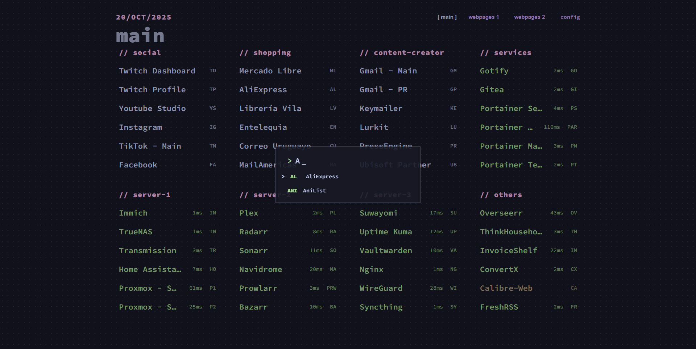
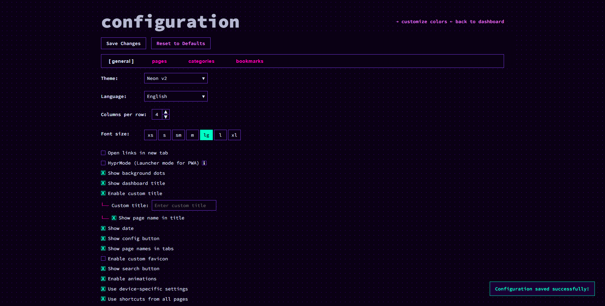

# ThinkDashboard

A lightweight, self-hosted bookmark dashboard built with Go and vanilla JavaScript.

## Features

- **Minimalist Design**: Clean, text-based interface
- **Keyboard Shortcuts**: Assign keys shortcuts to quickly open bookmarks
- **Customizable Categories**: Organize bookmarks into categories
- **Theme Support**: Dark and light themes
- **Theme customization**: Full theme customization support with possibility to create infinite variants
- **Responsive Design**: Works on desktop and mobile devices

## Screenshots

|  |  |
|--------------------------|--------------------------|
|  |  |

<p align="center">
  📱Mobile view<br>
  
</p>


## Quick Start

### Using Go

1. Clone the repository:
```bash
git clone https://github.com/MatiasDesuu/ThinkDashboard.git
cd ThinkDashboard
```

2. Install dependencies:
```bash
go mod tidy
```

3. Run the application:
```bash
go run .
```

4. Open your browser and navigate to `http://localhost:8080`

### Using Docker

1. Clone the repository:
```bash
git clone https://github.com/MatiasDesuu/ThinkDashboard.git
cd ThinkDashboard
```

1. Build the Docker image:
```bash
docker build -t thinkdashboard .
```

2. Run the container:
```bash
docker run -d -p 8080:8080 -v $(pwd)/data:/app/data --name thinkdashboard thinkdashboard
```

3. Open your browser and navigate to `http://localhost:8080` (or `http://youritp:yourcustomport`)

## Configuration

Access the configuration page by navigating to `/config` or clicking the "config" link in the top-right corner of the dashboard.
*You can also access it by typing `config` in the Search bar.*

## Color Customization

Access the color customization page by navigating to `/colors` or clicking the "customize colors" in the config page.
*You can also access it by typing `colors` in the Search bar.*


## Keyboard Shortcuts

Assign keys shortcuts to your bookmarks for quick access. Simply press the assigned keys on the dashboard to open the bookmark.

## Data Storage

Configuration data is stored in JSON files in the `data/` directory:
- `bookmarks-X.json`: Your bookmarks (each page will have the corresponded number, bookmarks-1.json, bookmarks-2.json, etc.)
- `colors.json`: Your theme colors (default and customs)
- `pages.json`: Pages order
- `settings.json`: Application settings


## License

This project is licensed under the MIT License - see the LICENSE file for details.